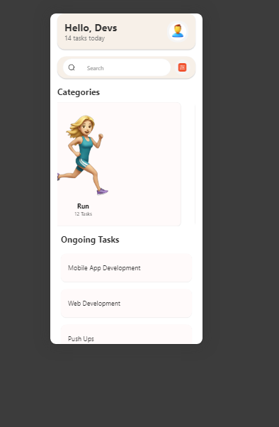
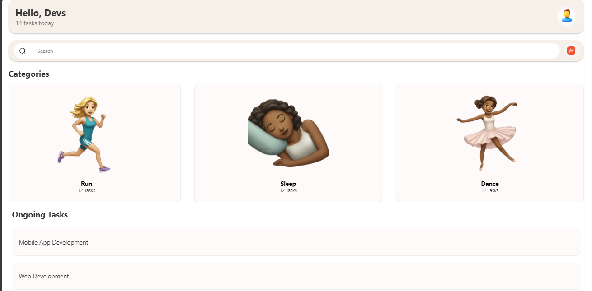

# rn-assignment3-11117649

# Task Management App

This is a simple task management app built with React Native. The app displays a list of tasks and categories, and allows the user to interact with the UI elements given.

## Installation

To get started with the project, follow these steps:

1. Clone the repository:
   git clone https://github.com/mrrjew/rn-assignment3-11225319.git

2. Navigate to the project directory:

3. Install the dependencies:

4. Start the development server:

# Usage

- Open the app on an emulator or a physical device using the Expo Go app.
- The home screen displays a greeting, a search bar, categories, and ongoing tasks.
- Tap on a category or task card to see the hover effect.

# App.js

This is the main file of the app. It contains the structure and layout of the home screen, including the header, search bar, categories, and ongoing tasks.

In the App.js, it contains the

# TaskCard:

A reusable component for rendering individual task cards. It uses `TouchableOpacity` for the hover and press effects.

# CategoryCard:

A reusable component for rendering individual category cards. It uses `TouchableOpacity` for the hover and press effects.

# styles

All the styling is done using `StyleSheet` in React Native. The styles are applied to the various components to provide a consistent look and feel.

# Styling

- The app uses `StyleSheet` for styling.
- Shadows and elevation are used to give a modern, material design look.
- Colors and font sizes are chosen to provide a pleasant and readable UI.

# Screenshots

